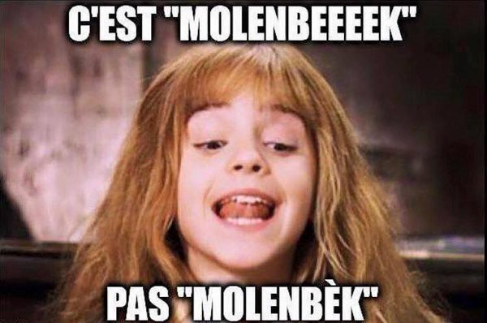
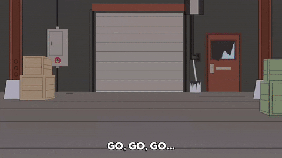

# Le retour de Laura

C'était le matin à **Becode**. 
*Corentin* fut réveillé par *Xavier*, a qui il avait promis d'aller faire une ballade dans **A6K**. 

Ils marchèrent jusqu'a l'aurée du bois quand soudain, *Laura* armé d'un **nerf** surgit d'un bosquet. 

*Corentin et Xavier* coururent vers un arbre où ils s'y cachèrent. 
*Laura* les chercha et failli repartir quand *Xavier* éternua. 
*Laura* se retourna, attrapa *Xavier* le mis dans le coffre de sa voiture électrique garée en contrebas et démara a toute allure.

---

## Benoit

Elle s'enfuya dans les petites rues de **Charleroi**, cependant tous les amis de *Xavier* se missent à sa poursuite en trottinettent électrique.

*Laura* commence a distancer ses poursuivant, elle essaye de rejoindre l'aeroport ou son complice l'attend, cependant elle se fait bloquer dans une petite rue par un bus que Doriano a détourné.

*Laura* n'a plus le choix et continue sa cavalle avec *Xavier* sur les épaules.

---

## Doriano

Soudain, elle croise David, un jeune pilote de vespa qui le propose de l'emmener elle et son prisonnier loin de Charleroi.

Après quelques heures de route, ils arrivent à Molenbeek et pas Molenbèk. Là-bas ils rencontrent Bob un ami, du cousin, de la cousine, de la sœur de David. Celle-ci se propose de les aider.

---

## Julien.S

Ils ce réfugiérent donc dans un vieux batiment abandonné, où une prise d'otage s'engagea entre Laura et les amis de Xavier prêts à lancer l'assault pour récupèrer leur ami.

L'assault enfin donné, c'est une bataille acharnée qui commence, les amis de Xavier tombe les uns après les autres, Laura est beaucoup trop forte pour eux !

---